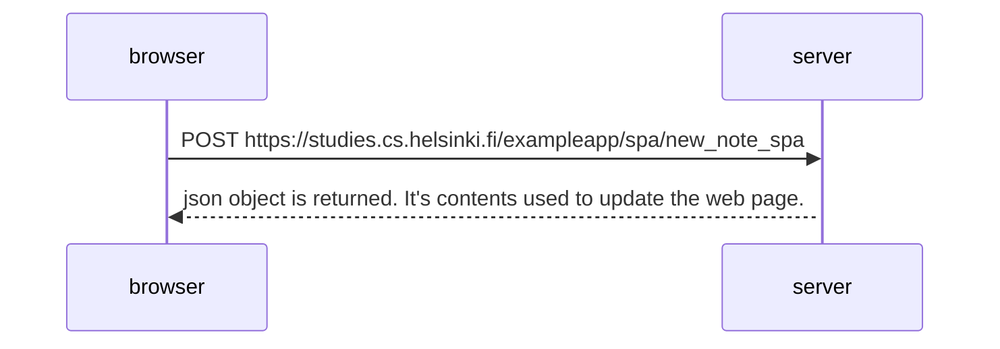

```mermaid
sequenceDiagram
    participant browser
    participant server
    
    %% POST new note with save button

    browser->>server: POST https://studies.cs.helsinki.fi/exampleapp/spa/new_note_spa
    activate server
    server-->>browser: json object is returned. It's contents used to update the web page.
```